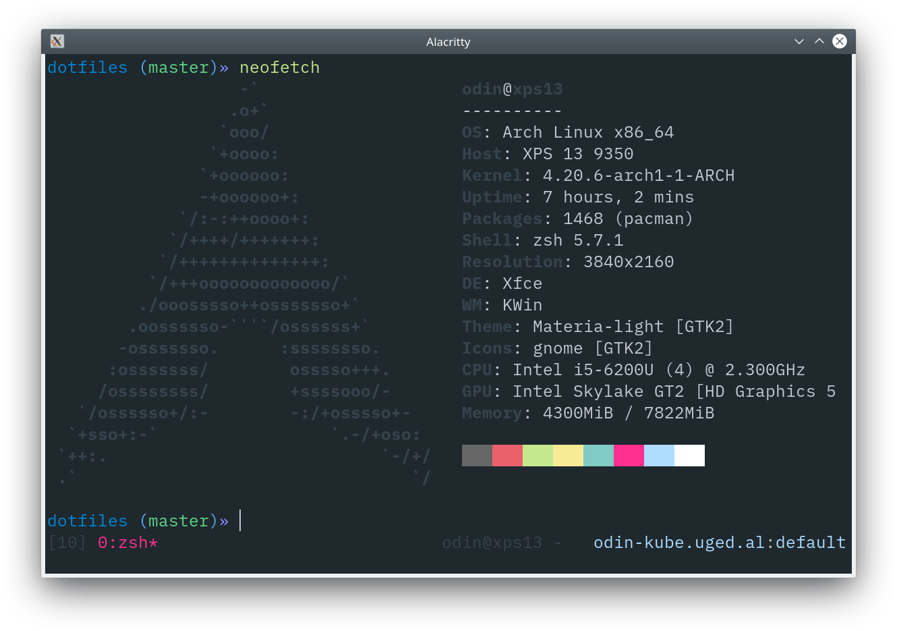

# dotfiles

> Dotfiles for vim, zsh, tmux, atom and some other stuff



## About

This is my dotfiles. Handled using [gnu stow](https://www.gnu.org/software/stow/).

**Includes**:

- vim
- tmux
- zsh
- misc (xorg ++)
- atom
- arch

## Install

```bash
$ make <whatyouwant>
```

_Example_: Install vim, zsh & tmux config

```bash
$ make vim zsh tmux
```

## Help

```bash
$ make help
Odin Ugedal - Dotfiles
Commands:
 - vim
 - atom
 - tmux
 - zsh
 - xorg
 - atom
 - atom-packages-restore
 - atom-packages-backup
 - arch-backup
 - arch-restore
```

MIT © [Odin Ugedal](mailto:odin@ugedal.com)
